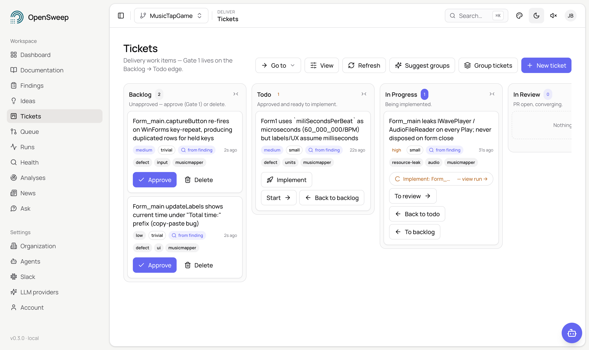
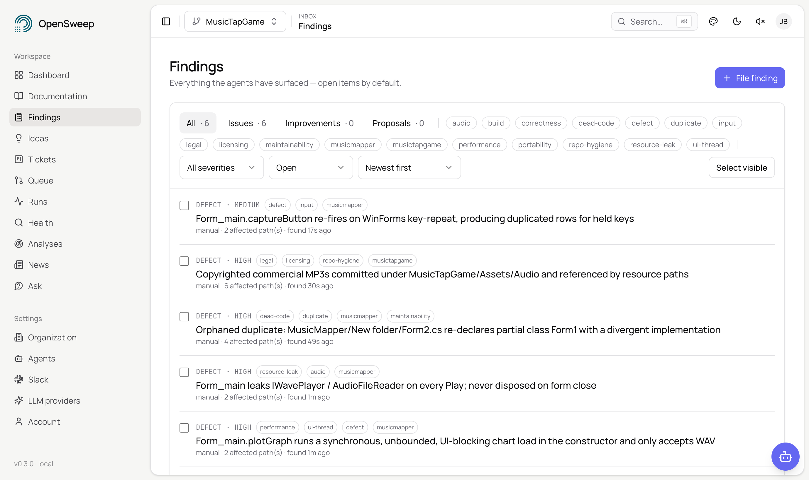
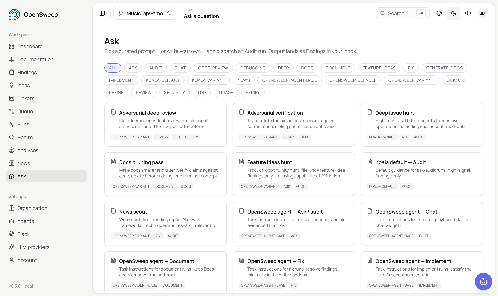

# OpenSweep

**Your coding agent on steroids — in a dashboard.**

[](https://opensweep.ai)
[](LICENSE)
[](#quickstart)

OpenSweep — [opensweep.ai](https://opensweep.ai) — runs AI agents that keep
your codebase healthy. Point it at your repos: agents sweep the code, write
docs that stay fresh, find bugs before you do, pick up tickets, open PRs,
review their own work, and push every PR to green. You do exactly two things —
approve tickets and merge PRs. Everything in between is agents.

<picture>
  <source media="(prefers-color-scheme: dark)" srcset="front_end/src/public/OpenSweep/OpenSweepTicketsDark.png">
  
</picture>

<picture>
  <source media="(prefers-color-scheme: dark)" srcset="front_end/src/public/OpenSweep/OpenSweepFindingsDark.png">
  
</picture>

## How it works

Two loops, running side by side:

- **Discovery** — agents sweep your repos, build a living doc tree, and file
  Findings: bugs, gaps, risks, missing tests, stale docs. Everything gets a
  freshness stamp, and new pushes trigger re-checks. Your codebase knowledge
  never rots.
- **Delivery** — triage a Finding into a Ticket and approve it. An agent
  implements it and opens a draft PR. A review agent judges the PR, fix runs
  respond, and the loop repeats until the PR converges — published as the
  `opensweep/converged` commit status, so you can see it right on GitHub.

> **Discovery:** Sweep → docs + memories + findings → checked stamps → re-check on push
> **Delivery:** Ticket → [you approve] → implement → PR → review → fix → CONVERGED → [you merge]

There's also **Ask** — a live chat session with an agent inside a sandboxed
clone of any repo, streamed straight to your browser.

<picture>
  <source media="(prefers-color-scheme: dark)" srcset="front_end/src/public/OpenSweep/OpenSweepAskDark.png">
  
</picture>

Bring your own agent: Claude Code, OpenAI Codex, any OpenAI/Anthropic-compatible
API, or fully local models (MLX, LM Studio, Ollama, OpenCode).

## Quickstart

You need Docker (with Compose), ~4 GB free RAM, and `git`.

```bash
git clone https://github.com/MurrMurrPlatform/opensweep.git
cd opensweep
./start.sh
```

That's it. The first run builds images and bootstraps the bundled Zitadel auth
(a few minutes); re-runs are fast and idempotent. Then:

- **App:** http://127.0.0.1:5174 — log in as `qa@opensweep.localhost` / `OpenSweepQA-Password1!`
  (operator: `zitadel-admin@zitadel.localhost` / `Password1!`)
- **API:** http://127.0.0.1:8001 (`/health`, `/docs`)
- **Neo4j Browser:** http://127.0.0.1:7475 (`neo4j` / `koalapassword`)

All ports bind to `127.0.0.1` — nothing is exposed to your network.

### Your first sweep

1. **Add an LLM provider** (Admin → LLM Providers) and mark one **Active**.
2. **Connect GitHub**: paste a [fine-grained access token](https://github.com/settings/personal-access-tokens/new)
   (Contents + Pull requests read/write on the repos OpenSweep should see) in
   the welcome wizard — or set `GITHUB_TOKEN` in `.env` before first login and
   it auto-connects. (Upgrade path: `scripts/github-app-setup.sh dev`
   provisions a GitHub App for auto-registered webhooks and short-lived
   per-repo credentials.)
3. Hit **Sweep this repo** — agents build the doc tree and start filing Findings.
4. Triage a Finding into a Ticket, approve it, hit **Implement** — and watch
   the draft PR drive itself to convergence.

## The building blocks

| Concept | What it is |
|---|---|
| **Agent** | A reusable, versioned definition: a prompt, what it produces (findings, answers, documentation…), and your org's tuning of the built-in system agents. |
| **Scheduled agent** | An Agent bound to a repository with a trigger — manual, on push, or cron — and a compute dial that bounds its autonomy. |
| **Doc** | Agent-written documentation that knows which files it covers and refreshes when they change. Exports to `AGENTS.md` via PR. |
| **Finding** | Something an agent noticed: a bug, gap, risk, missing test, or stale doc. Triage it: fix now, ticket it, or waive it. |
| **Ticket** | A unit of plannable work. Backlog → Todo is your approval gate. |
| **Memory** | A durable note an agent wrote for its future self — conventions, gotchas, decisions. |
| **Checked** | A freshness stamp: what was verified, when, at which commit, with what outcome. |
| **PR / Verdict** | The convergence ledger: a webhook-synced PR mirror plus SHA-bound review judgments. |
| **Session** | Live chat with an agent in a sandboxed repo clone — streaming, interruptible, transcribed. |
| **Policies** | Per-run cost ceilings, per-repo blocking thresholds, and a bound on fix rounds. Agents on a leash. |

## Security model

- **Zitadel OIDC** is the only user auth, in every environment — the bundled
  dev stack ships it and `./start.sh` configures it.
- **Webhooks** are HMAC-verified, idempotent per delivery, and fail closed
  when no secret is configured.
- **Credentials never enter sandboxes**: agents work in disposable clones
  fetched from GitHub (nothing mounted from your host), get an explicit
  env allowlist, and call back with scoped per-run tokens. Git pushes happen
  platform-side after a write gate. Stored credentials are encrypted at rest
  when `OPENSWEEP_SECRETS_KEY` is set.

## Verification

```bash
cd back_end && pytest
cd front_end && npm install && npm run type-check && npm run build
```

## OpenSweep Cloud

Want the same product with zero ops? [**OpenSweep Cloud**](https://opensweep.ai)
is the managed edition — we run the infrastructure, you keep the workflow.
Self-hosting stays free, always. Details and pricing at
[opensweep.ai](https://opensweep.ai).

## Development workflow

This is the canonical repo: **all product development happens here.**
OpenSweep Cloud is maintained as a private, purely additive overlay — a fork
that regularly merges this repo's `main` and only adds files (deployment
infrastructure, cloud-only modules such as billing). It never modifies files
that exist here, so changes merged into this repo land in both the
self-hosted and the managed product. Agent/dev environment notes live in
[`CLAUDE.md`](CLAUDE.md).

## License

OpenSweep is source-available under the [Elastic License 2.0](LICENSE):
free to use, modify, and self-host; you may not provide it to others as a
managed service. See `LICENSE` for the exact terms.

---

If OpenSweep is useful to you, a ⭐ helps other developers find it.
